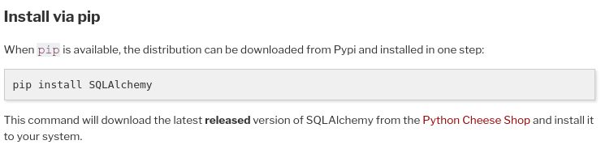
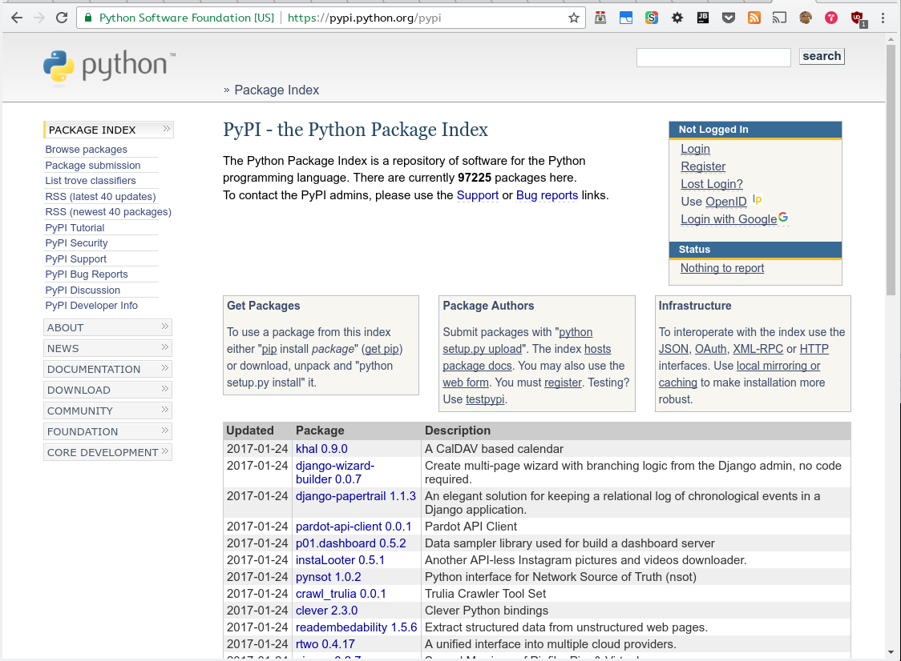
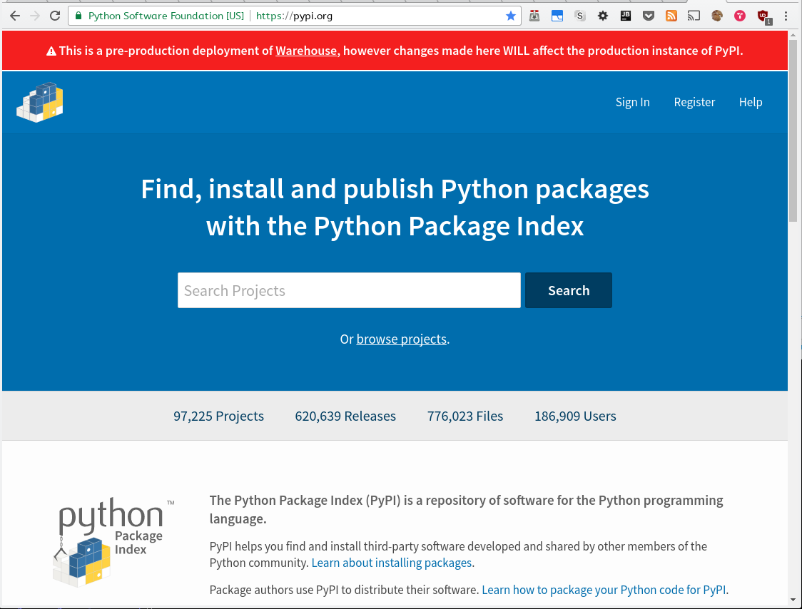

.. title: Gestión de paquetes y entornos en Python

:data-transition-duration: 500
:css: css/presentation.css
:css: css/monokai.css

----

:id: titulo

########################################
Gestión de paquetes y entornos en Python
########################################

----

:id: baterias

Se dice que...

Python trae **baterías incluidas**

----

:id: baterias-imagen

.. image:: images/Python_batteries_included.jpg
   :height: 300px

----

:id: casi-1

Esto es, que trae módulos para *CASI* todo.

----

:id: casi-2

CASI

----

:id: usar-python

Cuando Python no incluye lo que necesitamos, podemos instalarlo a través de ``Pip``.

----

:id: pip

Pip
===
Es el **gestor de paquetes** de Python que sustituye a ``easy_install`` desde *2008*. 

----

:id: ejemplo-instalar-pip

Ejemplo: instalar requests
--------------------------

Para instalar el paquete ``requests``, que facilita las consultas http:

.. code-block:: bash

    $ sudo pip install requests

----

:id: donde-paquetes-1

¿Y dónde puedo encontrar paquetes?
----------------------------------

* **Proyectos populares en Github**: https://github.com/trending/python
* **Paquetes recomendados para Python**: https://github.com/vinta/awesome-python
* **Los módulos más descargados**: http://pypi-ranking.info/alltime
* Tira de Google.

----

:id: donde-paquetes-2

La mayoría de paquetes Python dicen **cómo instalarlos** *usando Pip*

----

:id: pypi-1

¿Dónde se encuentran los paquetes de Pip?
-----------------------------------------
Subidos en **Pypi**. Puedes buscar los paquetes existentes en:

https://pypi.python.org/pypi

Además, puedes subir **tus propios paquetes**.

----

:id: pypi-2

----

:id: pypi-3

También puedes echarle un vistazo al **próximo** portal de *Pypi*:

----

:id: pip-versiones

Especificar versión
-------------------

Por si hubiese incompatibilidades, es posible **restringir la versión**:

.. code-block:: bash

    pip install 'Django>=1.7'
    pip install 'Django==1.8.3'
    pip install 'Django~=1.8'  # 1.8.x
    pip install 'Django>=1.8.2,<=1.8.10'

----

:id: pip-instalar-metodos

Y si no se encuentra en Pypi...
-------------------------------
Puedes instalarlo de infinidad de otras formas:

* Desde una **ruta local**: ``pip install /home/nekmo/myPackage``
* Usando una **url**: ``pip install http://domain/myPackage.zip``
* Con un **VCS** (Git/Hg/Bzr/Svn).

.. code-block:: bash

    $ pip install git+https://github.com/Nekmo/os3.git@master#egg=os3

----

:id: comandos-pip

Otros comandos de ``pip`` de interés
------------------------------------

* ``pip download <package>``: sólo **descargar** el paquete.
* ``pip list``: **listar** los paquetes instalados.
* ``pip uninstall <package>``: **desinstalar** el paquete.
* ``pip search <query>``: **Buscar** en Pypi.
* ``pip check``: Comprobar **incompatibilidades** entre paquetes instalados.
* ``pip freeze``: Generar **listado de dependencias**. Profundizaremos sobre este comando más adelante.

----

:id: comandos-pip-install-title

Parámetros útiles de ``pip install``
------------------------------------

----

:id: comandos-pip-install-1

Editable
^^^^^^^^
Usando ``-e``, se instala usando ``develop``. Esto es, que el paquete puede *editarse* en local y no hace falta reinstalarlo para aplicar los cambios.

.. code-block:: bash

    $ pip install -e ~/Projects/myProject
    

Upgrade
^^^^^^^
Es posible llevar un paquete a la **última versión** con:

.. code-block:: bash

    $ pip install --upgrade my-package

----

:id: comandos-pip-install-2
    
Pre-release
^^^^^^^^^^^
Por defecto, Pypi instala los paquetes **estables**. Pero es posible instalar los que están en **desarrollo**:

.. code-block:: bash

    $ pip install --pre my-package
   

Instalar en tu usuario
^^^^^^^^^^^^^^^^^^^^^^
Pip instala los paquetes a nivel de sistema por defecto (lo cual requiere root). No obstante, es posible instalarlo en **tu usuario**.

.. code-block:: bash

    $ pip install --user my-package
    
    
----

:id: comandos-pip-install-3

Cambiar o añadir repositorio
^^^^^^^^^^^^^^^^^^^^^^^^^^^^
Por **defecto**, ``pip`` usa como *repositorio* para descargar los paquetes::

    https://pypi.python.org/simple/
    
No obstante, es posible cambiarlo con ``--index-url``. Y añadir **repositorios extra** por si no estuviese el paquete en el *rep. principal* con el parámetro ``--extra-index-url``. Por ejemplo, para usar el *repositorio de pruebas* (para cuando se está aprendiendo a crear paquetes)::

    https://testpypi.python.org/simple/
    
Para saber cómo crear nuestro propio repositorio: https://github.com/pypiserver/pypiserver

----

:id: instalar-pip

Instalar Pip
------------
Por si no se encontrase instalado en el sistema, podemos **instalarlo** con:

.. code-block:: bash

    $ sudo apt install python-pip  # Debian/Ubuntu
    $ sudo dnf -y install python-pip  # Fedora
    $ sudo pacman -S python-pip
    
Y si no con:

.. code-block:: bash

    $ python get-pip.py
    
    
----

:id: conflictos-paquetes-1

Conflictos entre paquetes
=========================

Ya sabemos cómo instalar paquetes externos. 

*¿Pero qué pasa si tenemos conflictos entre ellos?*

----

:id: conflictos-paquetes-2

**Ejemplo:** tenemos *2 proyectos*, ``A`` y ``B``, con dependencia en diferentes versiones de Django.

* **Proyecto A:** requiere ``Django >= 1.8, <= 1.10``.
* **Proyecto B:** requiere ``Django <=1.7, >= 1.4``.

----

:id: conflictos-paquetes-3

Solución: **virtualenvs**

----

:id: virtualenvs

Virtualenvs
===========
Son *entornos* de Python **independientes al del sistema,** con sus propios paquetes instalados.

*Algunos ejemplos de uso son...*

----

:id: virtualenvs-ejemplo-conflictos

soluciona conflictos
--------------------

Gracias a los virtualenvs, podemos tener 2 entornos distintos: uno para el *proyecto A*, 
con ``Django >= 1.9``, y otro con ``Django <= 1.7`` en el *proyecto B*.

----

:id: virtualenvs-ejemplo-pruebas

Para pruebas
------------

Además, podemos usar los virtualenvs **para probar paquetes sin instalarlos** a nivel del sistema,
o para **crear entornos a replicar en otros sistemas**, cosa que veremos más adelante.

----

:id: virtualenvs-ejemplo-actualizacion

Aislar y evitar sorpresas
-------------------------

Los virtualenvs también nos salvan de *sorpresas* al **actualizar el sistema**: un ``apt upgrade`` podría romper nuestros proyectos sin saberlo.

----

:id: instalar-virtualenvs

Cómo crear un virtualenv
------------------------
Tras instalar ``virtualenv``, podemos **crear un virtualenv** con:

.. code-block:: bash
    
    [nekmo@homura /tmp]$ virtualenv venv
    Running virtualenv with interpreter /usr/bin/python2
    New python executable in venv/bin/python2
    Also creating executable in venv/bin/python
    Installing setuptools, pip...done.

----

:id: entrar-virtualenv

Cómo entrar en un virtualenv
----------------------------
Debemos ejecutar:

.. code-block:: bash
    
    [nekmo@homura /tmp]$ source venv/bin/activate
    (venv)[nekmo@homura /tmp]$ 
    
Véase que ahora, al inicio del *prompt*, tenemos *entre paréntesis* el nombre del virtualenv:

.. code-block:: bash
    
    (venv)[nekmo@homura /tmp]$ 
    
Esto significa, que tenemos el virtualenv **activado**. Podremos movernos con libertad, y seguiremos en el virtualenv mientras aparezca delante ese indicativo.

----

:id: salir-virtualenv

Cómo salir de un virtualenv
---------------------------
Debemos ejecutar ``deactivate``. Tras ejecutarlo, desaparecerá el nombre del virtualenv en el prompt:

.. code-block:: bash
    
    (venv)[nekmo@homura /tmp]$ deactivate 
    [nekmo@homura /tmp]$

Tras salir del virtualenv, podremos crear otro donde podremos instalar otros paquetes, manteniéndose aislados.

----

:id: instalar-virtualenv

Instalar virtualenv
-------------------
Podemos instalarlo bien **por el sistema**, o haciendo uso de **pip**, como cualquier otro paquete:

.. code-block:: bash

    $ sudo pip install virtualenv
    
----

:id: como-funcionan-virtualenvs-1

Cómo funciona
-------------
El archivo ``./bin/activate`` del ``venv`` es un fichero en bash, que si lo leemos, encontramos:

.. code-block:: bash

    PATH="$VIRTUAL_ENV/bin:$PATH"
    export PATH

Con esto lo que hacemos es añadir el directorio ``./bin/`` al ``$PATH``.

----

:id: como-funcionan-virtualenvs-2

Si miramos este directorio, encontramos:

.. code-block:: bash

    (test)[nekmo@homura /tmp/env]$ ls -1
    activate
    ...
    easy_install
    pip
    **python**
    ...

----

:id: como-funcionan-virtualenvs-3

Esto *sustituye* el binario de ``python`` del sistema por el del virtualenv.

Para determinar el directorio de las bibliotecas, lo que hace es buscarse el directorio que **contiene** ``./lib/pythonX.Y/os.py`` desde el directorio del ejecutable de Python. Si no se encuentra, se van **bajando niveles** hasta encontrarlo:

.. code-block:: bash

    ./venv/bin/lib/python2.7/os.py << No existe, sigo bajando...
    ./venv/lib/python2.7/os.py << ¡Existe! ¡Usaré este directorio!
    
----

:id: gestionar-virtualenvs

Pero ahora tengo muchos virtualenvs...

**¿cómo los gestiono?**

----

:id: virtualenvwrapper

Virtualenvwrapper
=================
Permite gestionar los virtualenvs *identificándolos por un nombre*, y organizados en un directorio común. Para instalarlo, usamos de nuevo ``pip``:

.. code-block:: bash

    $ sudo pip install virtualenv
    
----

:id: configurar-virtualenvwrapper

Configuración
-------------
En el ``.bashrc``, añadimos lo siguiente:

.. code-block:: bash

    export WORKON_HOME=$HOME/.virtualenvs
    export PROJECT_HOME=$HOME/Projects
    source `which virtualenvwrapper.sh`

La primera línea es donde se guardarán los *virtualenvs*. La segunda, donde creamos nuestros *proyectos y trabajos*. Veremos más sobre esto más adelante.

----

:id: crear-virtualenvwrapper

Crear un virtualenv con virtualenvwrapper
-----------------------------------------
Usamos el comando ``mkvirtualenv <name>``. Si ponemos el argumento ``-p <binario python>``, podremos cambiar el ejecutable de Python a usar:

.. code-block:: bash

    $ mkvirtualenv -p /usr/bin/python3 my-venv
    
Al crear un proyecto, *entraremos automáticamente en el*.

----

:id: salir-entrar-virtualenvwrapper

Salir y entrar en el virtualenv
-------------------------------
Para **salir** del virtualenv, el comando es igual que con los virtualenv de serie:

.. code-block:: bash

    $ deactivate
    
Y para volver a **entrar**, usamos ``workon``:

.. code-block:: bash

    $ workon my-venv
    
----

:id: proyectos-virtualenvwrapper

Proyectos
---------
Cuando se crea un virtualenv con ``mkproject <project name>``, se crea un virtualenv y adicionalmente un directorio en ``$PROJECT_HOME``, que es nuestro *directorio de proyectos*. Cada vez que se entre en el virtualenv, se activará el virtualenv y además, se accederá el **directorio del proyecto**:

.. code-block:: bash

    mkproject my-project

El resto de funciones son exactamente iguales a las de cualquier otro virtualenv.
    
----

:id: comandos-fuera-virtualenvwrapper

Comandos fuera del virtualenv
-----------------------------

* ``workon <venv>``: **Entrar** en un virtualenv.
* ``mkvirtualenv <venv>``: **Crear** un virtualenv.
* ``mkproject <proj>``: **Crea** un directorio de **proyecto** con su correspondiente virtualenv.
* ``mktmpenv``: **Crea** un virtualenv sin nombre y **temporal**, que al hacer deactivate se autodestruye.
* ``rmvirtualenv <venv>``: **Borrar** un virtualenv. En el caso de proyectos, no borra el dir. de proyecto.
* ``allvirtualenv <command>``: **Ejecutar** un comando en **todos los venv**. Útil para actualizar pip.

----

:id: comandos-dentro-virtualenvwrapper

Comandos dentro del virtualenv
------------------------------

* ``deactivate``: **Salir** del virtualenv actual.
* ``cdvirtualenv``: Ir al directorio *~/.virtualenvs/<venv>*.
* ``cdsitepackages``: Ir al directorio *~/.virtualenvs/<venv>/lib/PythonX.Y/site-packages*.
* ``cdproject``: En el caso de proyectos, *volver al directorio del proyecto*.
* ``wipeenv``: **Borrar** todos los **paquetes** del venv.
* ``add2virtualenv <dir 1>[ <dir 2>]``: Permite añadir directorios al site-packages del virtualenv sin instalarlos
* ``toggleglobalsitepackages``: Habilita o deshabilita que se puedan usar a **paquetes del sistema** en el virtualenv.

----

:id: hooks-virtualenvwrapper

Scripts personalizables (hooks)
-------------------------------
*Virtualenvwrapper* permite personalizar las acciones cuando se interactúa con los virtualenvs. Por ejemplo, ``postactivate`` permite ejecutar cuandos al activar el virtualenv, o ``postmkvirtualenv`` **ejecutar comandos** al crear un nuevo virtualenv. Esto puede usarse para *iniciar servicios* o *instalar paquetes*.

Un listado completo de los scripts se encuentra en: http://virtualenvwrapper.readthedocs.io/en/latest/scripts.html

Es posible crear scripts *por cada virtualenv* o *de forma global*.

----

:id: requirements

Requirements
============
Tras instalar los paquetes que necesitamos, podemos querer **replicar la misma instalación** que ya funciona en otro equipo, como por ejemplo pasarlo a **producción**. Esto podemos lograrlo gracias al archivo ``requirements.txt``.

En este archivo apuntamos las dependencias necesarias para que un proyecto funcione. Por ejemplo:

.. code-block:: bash

    requirements.txt
    ----------------
    Django>=1.9.1
    six==1.10.0
    appdirs==1.4.0
    
----

:id: instalar-requirements

Luego podemos **instalar las dependencias** mediante:

.. code-block:: bash

    pip install -r requirements.txt
    
Con esto podemos **replicar la instalación** de la *máquina original* en *otras máquinas*.

----

:id: pip-freeze

pip freeze
----------
El comando ``pip freeze`` nos permite generar un **listado de las dependencias instaladas** con la versión con el formato ``paquete==versión`` por cada línea. Podemos usar este comando para generar el archivo ``requirements.txt`` con las **dependencias exactas** que hay en el virtualenv actual:

.. code-block:: bash

    $ pip freeze > requirements.txt
    
----

:id: constraints-1

Constraints
-----------
En ocasiones, podemos no desear instalar *ciertos paquetes* en la máquina de producción, como *los de desarrollo*, o los instalados *por pruebas*; pero también queremos asegurar que se instalan las **versiones correctas** de los paquetes y sus dependencias, para evitar problemas. Para ello podemos usar **constraints**:

.. code-block:: bash

    $ pip freeze > constraints.txt
  
----

:id: constraints-2
  
Luego, en *el requirements* especificamos lo que nosotros quisimos **instalar explícitamente**, y *el constraints* se asegurará de instalar las **versiones correctas** de los paquetes y sus dependencias, pero no se instalarán los paquetes del *constraints* que no estén especificados en el *requirements*:

.. code-block:: bash

    requirements.txt
    ----------------
    -c constraints.txt
    pandas
  
----

:id: constraints-3
  
Y el ``constraints.txt`` **generado automáticamente** usando ``pip freeze > constraints.txt``:

.. code-block:: bash

    constraints.txt
    ---------------
    appdirs==1.4.0
    numpy==1.12.0
    packaging==16.8
    pandas==0.19.2
    pyparsing==2.1.10
    python-dateutil==2.6.0
    pytz==2016.10
    six==1.10.0

----

:id: utilidades

Otras utilidades
================

* ``pipdeptree``: Representa las *dependencias* instaladas en *forma de árbol*. Ayuda a comprender **qué paquete instaló cual**.
* ``Pipfile``: Otra forma de trabajar con los archivos de requirements, que facilita *distinguir entre entornos* y *qué paquetes se instalaron explícitamente*.
* ``pipenv``: Aúna en uno ``virtualenv``, ``Pipfile`` y ``Pip``. *Crea virtualenvs automáticamente* en tu proyecto.
* ``pip-tools``: Ayuda a **mantener los paquetes actualizados**. Usando archivos de dependencias propios, se compilan los archivos de requirements.
* ``compare-requirements``: Compara archivos de ``requirements.txt`` y permite *compararlos* con los requirements del venv.
* ``curd``: Alternativa compatible con ``pip``, que le ofrece **mayor velocidad** en la instalación de paquetes.

----

:id: acerca-de
    
Sobre esta presentación...
==========================

* **Código fuente presentación:** https://github.com/Nekmo/python-packages-management
    
.. note::
    si te ha gustado la presentación, puedes verla en mi Github, y no olvidéis darle a like :)

----
    
:id: end

¡Muchas gracias a todos!
========================

* **Sitio web:** http://nekmo.com
* **Email:** contacto@nekmo.com
* **Telegram:** @nekmo
* **Twitter:** @nekmocom

.. note::
    Muchas gracias. Por si queréis hablar conmigo, podéis hacerlo por estos medios, o luego al final.
